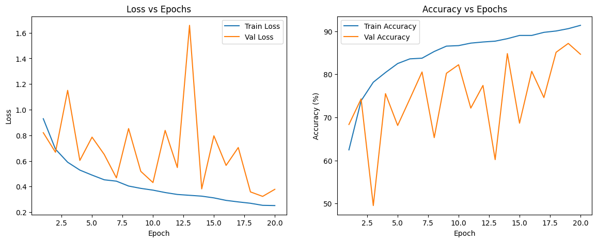

# 🧠 Dual Input LSTM for Brain Tumor Classification

This project implements a deep learning model that classifies brain tumors using MRI images. It leverages a **Dual Input LSTM architecture**, taking both **grayscale images** and their **sketch-enhanced counterparts** as input to improve classification performance.

---

## 📌 Overview

- **Dataset**: [Brain Tumor MRI Dataset](https://www.kaggle.com/datasets/masoudnickparvar/brain-tumor-mri-dataset) (via `kagglehub`)
- **Architecture**: Dual Bidirectional LSTM (grayscale + sketch)
- **Framework**: PyTorch
- **Task**: Multi-class classification of brain tumor types

---

## 🗂️ Classes

The dataset consists of MRI scans categorized into 4 tumor types:

- Glioma
- Meningioma
- Pituitary
- No Tumor

---

## 🚀 Features

- Dual-stream input (grayscale and sketch-enhanced images)
- Bidirectional LSTMs for spatial sequence processing
- Multi-layer dense classifier with dropout and batch normalization
- Early stopping to prevent overfitting
- Training metrics visualization (loss & accuracy plots)

---

## 🛠️ Setup


### 🧩 Required Libraries

- `torch`, `torchvision`
- `kagglehub`
- `Pillow`
- `matplotlib`

---

## 📥 Dataset Download

The dataset is automatically downloaded using [`kagglehub`](https://pypi.org/project/kagglehub/):

```python
import kagglehub
path = kagglehub.dataset_download("masoudnickparvar/brain-tumor-mri-dataset")
```

Directory structure:

```
brain-tumor-mri-dataset/
├── Training/
│   ├── glioma/
│   ├── meningioma/
│   ├── pituitary/
│   └── no_tumor/
└── Testing/
    ├── glioma/
    ├── meningioma/
    ├── pituitary/
    └── no_tumor/
```

---

## 🧠 Model Architecture

### 📄 Dual LSTM Classifier

- 2 Bidirectional LSTM branches: one for grayscale input, one for sketch input.
- Last hidden states from both LSTMs are concatenated.
- Passed through a deep fully connected classifier:

```text
Gray LSTM →           ↘
                       ➜ Concatenate → Dense Layers → Output
Sketch LSTM →         ↗
```

---

## 🏋️ Training

- **Loss Function**: CrossEntropyLoss
- **Optimizer**: Adam (`lr=1e-4`)
- **Early Stopping**: Patience = 5
- **Epochs**: 20

The model is trained using `train_model()` and best weights are saved to `best_model.pth`.

---

## 📊 Results Visualization

Training and validation loss & accuracy are plotted using Matplotlib:

<p align="center">
  
</p>

---

## 📝 How to Run (Google Colab)

1. Upload this notebook to [Google Colab](https://colab.research.google.com/).
2. Run all cells sequentially.
3. Download the best model (`best_model.pth`) if needed.

---

## 📎 Author

**Rohit Raj**  
[LinkedIn](https://www.linkedin.com/in/rohit-raj-082b3136b)  


